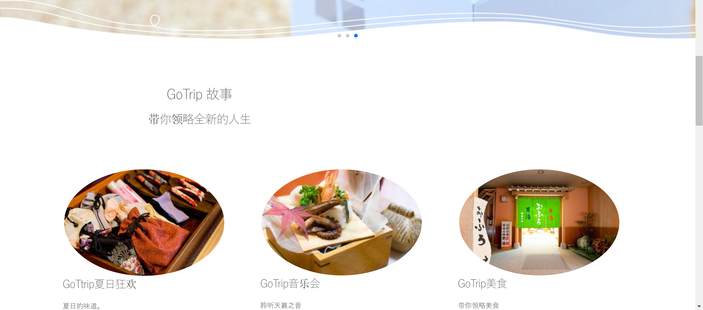
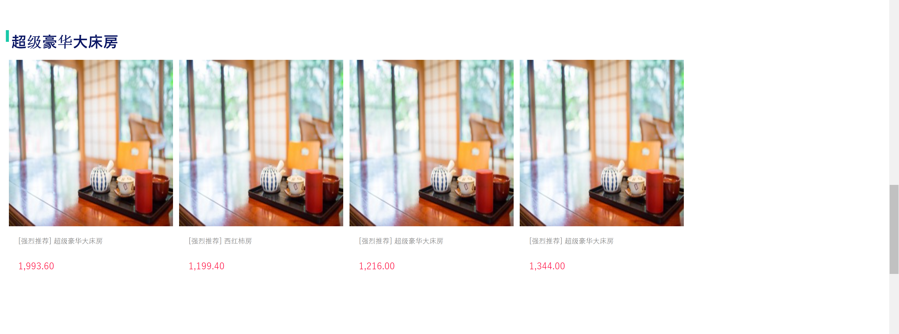
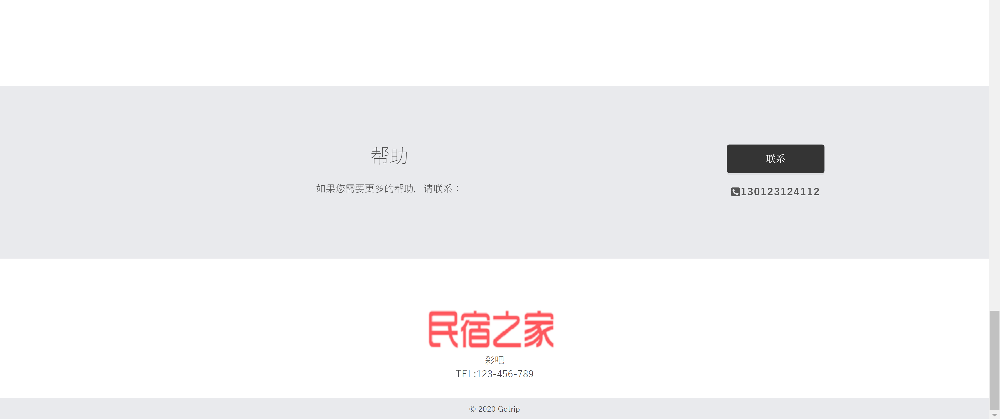
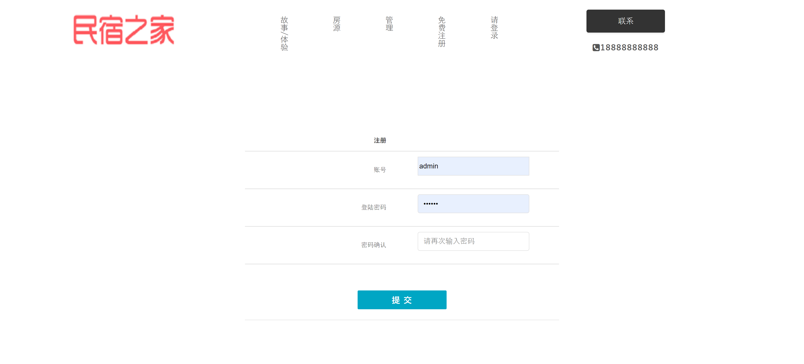
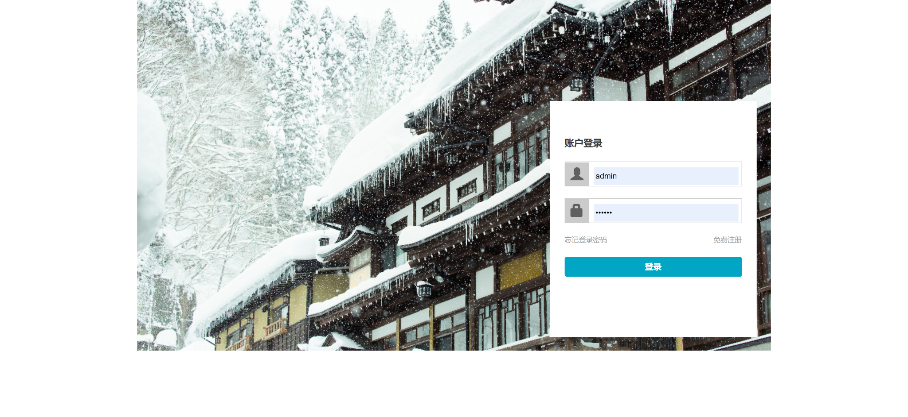
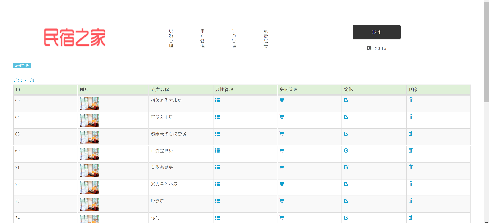
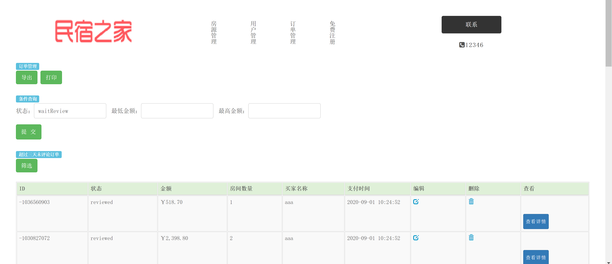

<h1 align="center">民宿房源管理系统</h1>

## 简介
民宿房源管理系统：角色分为管理员、用户；功能包括房源管理、用户管理、订单管理、注册登录、房源搜索与筛选、订单编辑与删除、活动体验介绍。    --计算机毕业设计源码；毕设源码；java毕业设计源码

## 联系方式

<h3 align="center">获取完整代码与数据库文件 + 微信：bysj5151 QQ: 86050149 QQ群: 783742310</h3>

<h3 align="center">可帮忙远程部署 包运行成功！提供远程部署、修改代码、设计文档指导、代码讲解等服务！</h3>

## 功能介绍（完整见运行截图）
管理员： 基本功能：登录，注册，管理房源和用户信息。房源管理：查看房源列表，添加、编辑、删除房源，搜索和筛选房源。订单管理：导出、打印订单，筛选订单状态，查看订单详情。用户管理：处理用户注册信息，联系用户。  
用户： 基本功能：注册，登录，浏览和搜索房源。房源互动：查看房源详情，比较房间信息，进行筛选。订单服务：提交订单，查看订单状态和详情。个人体验：参与“GoTrip 故事”模块活动，享受多样化生活体验。

## 运行截图

本代码来源于网络,仅供学习参考使用!

